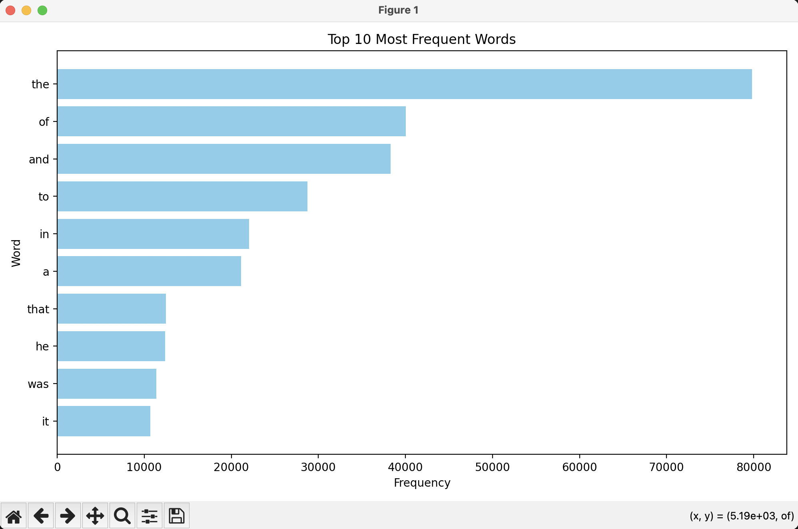

# Homework for the module “Asynchronous Processing”

## Task 1 - Asynchronous File Sorting by Extension

**Description:**  
Write a Python script that reads all files in a user-provided **source** folder and distributes them into subfolders inside an **output** folder based on file extensions. The sorting must be performed **asynchronously** to handle large numbers of files efficiently.

**Implemented:**
- Recursively scans the source directory.
- Asynchronously copies files into subfolders named by extension (e.g., 'txt/', 'jpg/', 'tar.gz/').
- Skips hidden/service directories (e.g., '.git', '.idea', 'node_modules', '__pycache__') and hidden files.
- Logs errors and prints execution time.
- PEP 8–compliant and readable structure.

### Usage
Sort files from a source folder into subfolders in the output folder based on file extensions.

### Command syntax

``` 
python async_file_sorter.py --source <SOURCE_DIR> --output <OUTPUT_DIR> [options]
```
### Required arguments

* --source — Path to the source folder to scan (recursively).
* --output — Path to the output folder where sorted files will be placed.

### Examples
Sort all files from ./inbox into ./sorted:
``` 
python async_file_sorter.py --source ./inbox --output ./sorted
```

 ## Task 2 - MapReduce Word Frequency Analysis

 **Description:**  
Write a Python script that downloads text from a given URL, analyzes word frequency in the text using the MapReduce paradigm, and visualizes the top most frequent words.

**Implemented:**
- The code downloads text from a given URL.
- Performs word frequency analysis using MapReduce.
- Visualization displays top words by frequency.
- The code uses multithreading.

### Example output

**Top 10 most frequent words**

